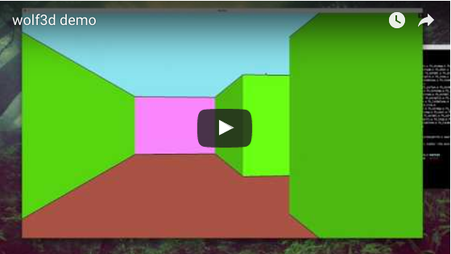

# **Wolf3d**
#### *It's the second project in the graphic branch.*

The subject asks to code a **C** program wich can **display** a **representation of a fractal** and allow the user to **interact with it**.

We are allowed to use the **minilibx library** to manipulate a window and drow in it.
The main difficulties are to **find mathematical expressions** and **optimize it**.

## **The render**

## **Fractals availables**

* Mandelbrot
* Julia
* Burning ship

## **Commands availables**

* Zoom						**Scroll up / down or left click**
* Enable / Disable Julia's variations		**v**
* Change color				**C**
* Add accuracy			**+ / -**
* Help						**H**
* Change fractals			**1 2 3**
* Quit						**ESC**

## **Disclaimer**

The minilibx version is for MacOs so it probably won't work on other OS.

